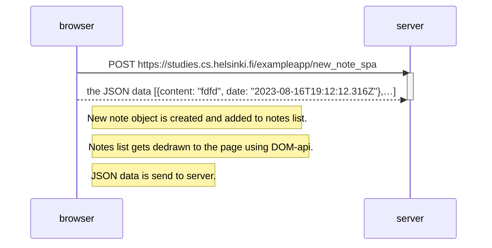

```mermaid
sequenceDiagram
    participant browser
    participant server

    browser->>server: POST https://studies.cs.helsinki.fi/exampleapp/new_note_spa
    activate server
    browser-->>server: the JSON data [{content: "fdfd", date: "2023-08-16T19:12:12.316Z"},…]
    deactivate server

    Note right of browser: New note object is created and added to notes list.
    Note right of browser: Notes list gets dedrawn to the page using DOM-api.
    Note right of browser: JSON data is send to server.
```